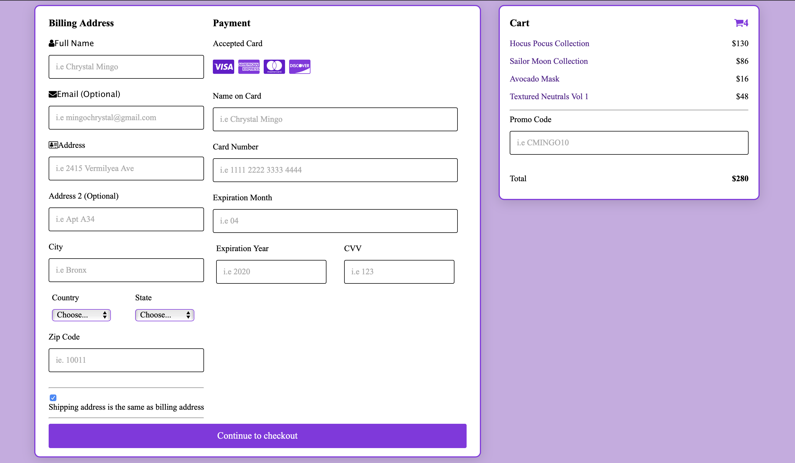

# WebsiteDesign_CheckoutForm
#### Chrystal Mingo
#### CSC 47300 - Website Design

##### Homework 4 | Part 1

##### I Built a checkout form. Which has a billing address section, shipping address section, payment section, and a cart section. If the checkbox “Shipping address is the same as my billing address” is clicked, then the shipping address section shouldn’t appear. Has null/empty validation to non-optional inputs. 

